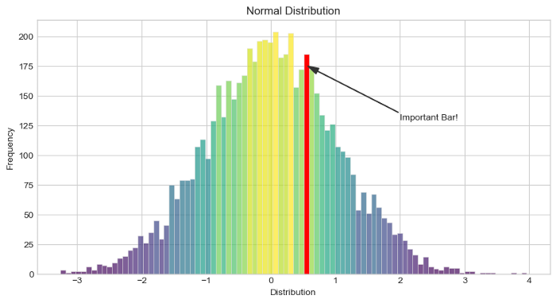

```{r setup, include=FALSE}
knitr::opts_chunk$set(echo = TRUE)
```

## Sunny's favorite animal[#]


## Sunny's favorite plot



You can also embed plots, for example:

```{r pressure, echo=FALSE}
plot(pressure)
```


## Link to Sunny's CV
